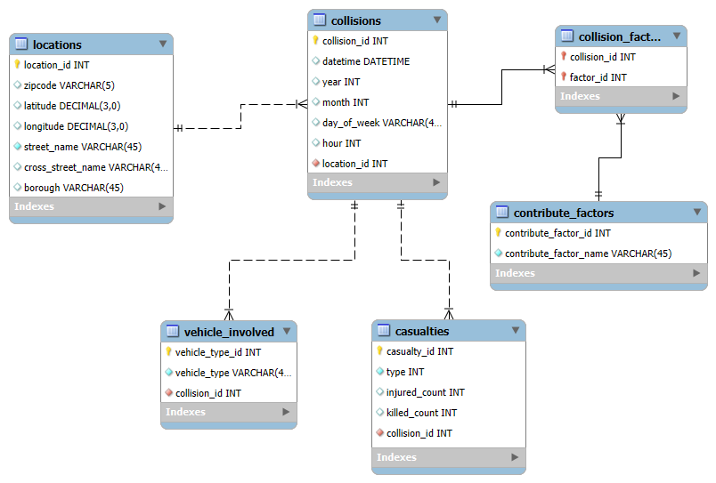

# Executive Summary

The text in this section includes:

- overview summary
New York City (NYC) is popular for walking and biking among residents due to its population density. 
The majority of New Yorkers chose to walk, bike, or take public transportation to travel around the city more easily and conveniently, compared to driving their own vehicle. 
From the previous data, NYC was named as a home of 1550 miles of bike lanes, paths, and neighborhood greenways, 
making it the largest bicycle network across North America (Foersterling 2025). 
Especially, Manhattan and Brooklyn counties, with 60% of trips made on foot or by bike. 
Since walking and biking are the main modes of transportation across NYC, 
it is important to improve the safety and traffic infrastructure, further protecting pedestrians and cyclists. 
According to the New York Statistics report, Manhattan and Brooklyn are the more dangerous areas in the city than the rest, 
with the highest number of cyclist deaths in 2024 in Brooklyn and the overall traffic death rate in Manhattan.  
In this analysis, we chose to focus on the motor vehicle collisions in the New York City area. 
The dataset that we used is the Motor Vehicle Collisions - Crashes dataset from data.gov, that showing the details of crash events, 
including borough, location, street name, the number of injured/killed, and contributing factors. 
The data records were collected by using the police report MV104-AN form, published and managed by the NYPD. 
We want to analyze and identify the “hot zone” and accident trends that involve either pedestrians or cyclists, 
especially focusing on the Brooklyn and Manhattan areas. So, we can use our data and analysis to help focus on safety 
improvements across the NYC borough. 

- discussion of audience & purpose
The target audiences of our project are data analysts and urban planners, to identify the hotspots and behavioral trends of accidents
involving pedestrians or bicyclists within Brooklyn and Manhattan. The purpose of this analysis is to provide data-driven insights 
and resource allocation for NYC by cleaning and transforming the data into a well-structured dataset. By looking at the data, 
our audience can conduct a study of whether specific routes/ intersections are most dangerous for pedestrians and cyclists. 
We also want to ensure that the dataset is efficient and accessible to our key audience to use in city planning, and help the NYC 
Department of Transportation to develop plans to improve traffic safety, protect city travelers, and minimize deadly accidents in 
these specific areas. 

- conclusions/final discussion
In conclusion, the intended purpose for this project is to provide data analysts and urban planners a "ready to use" tool to support their 
work in identifying the hotspots and behavioral trends of accidents, and resource allocation for the NYC areas, especially, Manhattan and 
Brooklyn. First, we narrowed down our research scope to only focus on two targeted boroughs. By sorting out the targeted data points, we 
reduced the dataset from millions of records down to approximately (...number...) records. Besides that, the original dataset contained 
null and missing values from incompleted accident reports, so we dropped all missing records to avoid data noise or outliers while analyzing
or visualizing data trends. We also wanted to ensure that there are no null values in latitude and longitude because they are important 
attributes that allow our stakeholders to determine the hotspots. Stakeholders can use these coordinators to spot danger locations on maps, 
as well as using them to develop safety policy. Once again, we only targeted pedestrians and cyclists to improve walking and biking safety 
in Manhattan and Brooklyn areas. Next, we broke down the date and time into separated columns, instead of keeping them together like the 
original dataset. We wanted to make our dataset more accessible to our stakeholders to use in examine and creating research reports, so we 
broke date and time data records into year, month, day, and hour, so that, our stakeholders can use them to identify "rush hours" in the 
targeted boroughs. Finally, we created an ERD for our dataset and a database script using MySQL Workbench. Our ERD (Enitity-Relationship 
Diagram) provides a visual map to our audience, giving them an idea of the database structure that data analysts and their clients can 
easy to understand without technical skills. Besides the ERD, our team also provides a database script (created from the ERD) using MySQL 
that allows our stakeholders to physically create, change, and manage the database on the server conveniently while working with and 
examine our dataset. 

# Source(s) & Extraction

The text in this section includes:

- details and documentation about the **source** of the data
Dataset: https://catalog.data.gov/dataset/motor-vehicle-collisions-crashes 
Location: City of New York
Publisher: data.cityofnewyork.us 
Access: Public
Modification: weekly/daily by NYPD
Data Format: CSV 
Data Content: each row is a crash event 

- discussion of how the data was originally collected or generated (how did it get recorded?)
First, we actively searched for the crime dataset on data.gov, then we used the search bar on the home page to search for the “crime”
keyword. Since we wanted to focus on the collision dataset, we agreed to use the Motor Vehicle Collision - Crashes, provided by NYPD. 
We wanted to use this dataset because we want to identify the accident trends in some specific areas in NYC, 
especially focusing on crowded areas for pedestrians and cyclists. This dataset includes more than a million records since 2021 
and more than 20 attributes. The dataset is a compilation of police reports made by NYPD officers responding to vehicle crashes. 
Police reports are required to be made when collisions result in a death or injury. (Car accidents like “fender benders” may not be
represented in the dataset because they don’t require police attention, which may lead to potential biases in 
the analysis of this project.) 
In April 1998, the New York Police Department (NYPD) implemented TrafficStat and used form MV-104AN to fill out all vehicle collisions.
Here is the MV-104AN form that the police department used to record the traffic incidents 
(https://www.nhtsa.gov/sites/nhtsa.gov/files/documents/ny_overlay_mv-104an_rev05_2004.pdf). 
This form has all the details of a traffic collision, which includes clear information, such as travel directions, contributing factors,
types of collision, and more. Then, the police department implemented the new system called TAMS in 1999 to collect traffic data 
from the MV-104AN form by entering the collected data manually into the system. Later on, they replaced the TAMS system with 
the new Finest Online Records Management System (FORMS), enabling the police officers to electronically
enter all of the MV-104AN data fields into the data warehouse. 
An important question regarding the value of this data source is whether we can use this data to improve public safety. 
This data source provides five different contributing factors to the collision for designated vehicles, which we can use 
to identify the trends of common collision causes. For example, we can group similar factors into the same category, and 
then we can analyze which factors are likely to cause vehicle crashes. From this point, we can draw out the solutions for how to minimize
the probability of traffic incidents based on each factor category. However, I believe that while drawing out the solutions, 
we should use additional data sources to further support the final decisions, because knowing the causes of collisions 
would not be enough to decide how to reduce them.

- details about each of the original variables
“Contributing factor” and “vehicle type code” may be blank depending on the number of factors or number of vehicles involved.

Crash Date: date of the crash in day/month/year (mm/dd/YYYY)
Crash Time: time of the crash in 24-hour time (00:00)
Borough: 2 out of 5 districts of NYC, including Brooklyn and Manhattan (text)
Zip code: zip code number (5 digits)
Latitude: numeric (decimals)
Longitude: numeric (decimals)
On Street Name: the primary street (text)
Cross Street Name: The nearest intersecting road (text)
Number of Pedestrians Injured: numeric 
Number of Pedestrians Killed: numeric
Number of Cyclist Injured: numeric 
Number of Cyclist Killed: numeric 
Contributing Factor Vehicle 1: accident factor number 1 (for example, unspecified, failure to yield, passing too closely, unsafe speed,
aggressive driving/road rage, following too closely, driver inattention/distraction, accelerator defective, etc.) (text)
Contributing Factor Vehicle 2: accident factor number 2 (for example, unspecified, failure to yield, passing too closely, unsafe speed,
aggressive driving/road rage, following too closely, driver inattention/distraction, accelerator defective, etc.) (text)
Collision_Id: a unique identification of each collision (numeric)
Vehicle Type Code 1: type 1 of vehicle involved in the accident (for example, sedan, bus, pick-up, dump, station wagon, bike, e-scooter,
ambulance, taxi, box van, etc.) (text)
Vehicle Type Code 2: type 2 of vehicle involved in the accident (for example, sedan, bus, pick-up, dump, station wagon, bike, e-scooter, 
ambulance, taxi, box van, etc.) (text)

```{python}
# The code chunk(s) in this section should include:
# - code that gets the data from the source into Python
# - code that does some initial (re-)formatting
# - code that accomplishes merging (if merging is performed)

# The code should be well-documented, including how choices were made.

import pandas as pd #pandas library needed to make dataframes and change data.
df = pd.read_csv(
    "Motor_Vehicle_Collisions.csv", #downloaded csv from dataset above and read using pandas
    dtype={"ZIP CODE": str}, # ZIP CODE column contained mixed data types. Changed to string.     
    low_memory=False
)

df.head() #displays the first five rows of the dataset, allowing us to verify that the data loaded correctly and to preview
df.info() #provides a summary of the dataset
df.isnull().sum().sort_values(ascending=False).head(10) #identifies the variables with the highest number of missing values. This is important for evaluating data quality and determining which variables may require cleaning

# Columns that are relevant to the analysis, focusing on pedestrians and cyclist.
relevant_columns = [
    'CRASH DATE',
    'CRASH TIME',
    'LATITUDE',
    'LONGITUDE',
    'BOROUGH',
    'ZIP CODE',
    'ON STREET NAME',
    'CROSS STREET NAME',
    'NUMBER OF PEDESTRIANS INJURED',
    'NUMBER OF PEDESTRIANS KILLED',
    'NUMBER OF CYCLIST INJURED',
    'NUMBER OF CYCLIST KILLED',
    'CONTRIBUTING FACTOR VEHICLE 1',
    'CONTRIBUTING FACTOR VEHICLE 2',
    'COLLISION_ID',
    'VEHICLE TYPE CODE 1',
    'VEHICLE TYPE CODE 2'
]

#Creating a new datafram with the relevant columns needed.
NYC_df = df[relevant_columns]

NYC_df.head()
print(len(NYC_df))
```


# Analysis & Evaluation

The final variable set includes seven numeric variables and ten categorical variables:
Numeric:
- 'LATITUDE'
- 'LONGITUDE'
- 'NUMBER OF PEDESTRIANS INJURED'
- 'NUMBER OF PEDESTRIANS KILLED'
- 'NUMBER OF CYCLIST INJURED'
- 'NUMBER OF CYCLIST KILLED'
- 'TOTAL_PED_CYC_CASUALTIES' (Aggregate of totals for pedestrians/cyclists injured or killed)

Categorical:
- 'YEAR'
- 'MONTH'
- 'HOUR'
- 'BOROUGH'
- 'ZIP CODE'
- 'DAY_OF_WEEK'
- 'CONTRIBUTING FACTOR VEHICLE 1'
- 'CONTRIBUTING FACTOR VEHICLE 2'
- 'VEHICLE TYPE CODE 1'
- 'VEHICLE TYPE CODE 2'

- Numeric Variable Exploratory Data Analysis
For each numeric variable, summary statistics were created using `.describe()` and null counts.
```
# Iterate through numeric features and generate descriptive stats for each
for col in numeric_cols:
    print(f"\n{col}:\n")
    print(df_clean[col].describe())
    print(f"Null Count: {df_clean[col].isnull().sum()}")
```
Latitude and Longitude both had erraneous (0,0) values, which distort both means. Thus, the visualizations for each were filtered to only include values > 1, code for the histograms given below:
```
# Lat/Long Historgrams
import matplotlib.pyplot as plt

df_clean[df_clean['LATITUDE'] > 1]['LATITUDE'].hist(bins=30)
plt.title('Latitude')
plt.xlabel('Latitude')
plt.ylabel('Count')
plt.show()

df_clean[df_clean['LONGITUDE'] < -1]['LONGITUDE'].hist(bins=30)
plt.title('Longitude')
plt.xlabel('Longitude')
plt.ylabel('Count')
plt.show()
```
The resulting histograms depict unimodal distributions, centered around latitude: 40.69, longitude: -73.96. This is a stark contrast between the means without filtering, where mean (latitude) = 40.46 and mean (longitude) = -73.53. Both of these means do not fall under the filtered distributions and indicate a significant skewing due to data quality issues.

Both NUMBER OF PEDESTRIAN INJURED and NUMBER OF CYCLIST INJURED have similar distributions. Since data was filtered for records with either pedestrian and/or cyclist casualties, most pedestrian/cyclist injury counts are either zero or one. However, pedestrian injured has a mean of ~0.649 and a median of 1.0, while cyclist injured has a mean and median of ~0.375 and 0.0, respectively. This indicates a greater prevalence of pedestrian-motor vehicle accidents than cyclist-motor vehicle accidents. Pedestrians injured had a striking outlier of 27, likely a catastrophic event. The maximum cyclists injured in the data was four, a large but much less eye-catching number.

Both NUMBER OF PEDESTRIAN KILLED and NUMBER OF CYCLIST KILLED also expectedly had similar distributions. Pedestrain killed mean of ~0.006 and cyclist killed mean of ~0.001 indicate a very rare mortality rate among motor vehicle-pedestrian/cyclist accidents. Again, a slightly higher mean for pedestrians likely is due to the higher volume of pedestrian-motor vehicle accident data in the dataset. Pedestrians killed had a much higher maximum value again with six, potentially occuring in the same event as the 27 injuries. Cyclists killed had a maximum of 2, a much more tame number. The code for the histograms for NUMBER OF PEDESTRIAN INJURED, NUMBER OF PEDESTRIAN KILLED, NUMBER OF CYCLIST INJURED, and NUMBER OF CYLCIST KILLED is pasted below:
```
# Number of Pedestrians Injured/Killed Histograms

import numpy as np

df_clean['NUMBER OF PEDESTRIANS INJURED'].hist(bins=range(0, 7))
plt.title('Number of Pedestrians Injured')
plt.xlabel('Number Injured')
plt.ylabel('Count')
plt.show()

df_clean['NUMBER OF PEDESTRIANS KILLED'].hist(bins=range(0, 7))
plt.title('Number of Pedestrians Killed')
plt.xlabel('Number Killed')
plt.ylabel('Count')
plt.show()

# Number of Cyclists Injured/Killed Histograms

df_clean['NUMBER OF CYCLIST INJURED'].hist(bins=range(0, 7))
plt.title('Number of Cyclists Injured')
plt.xlabel('Number Injured')
plt.ylabel('Count')
plt.show()

df_clean['NUMBER OF CYCLIST KILLED'].hist(bins=range(0, 7))
plt.title('Number of Cyclists Killed')
plt.xlabel('Number Killed')
plt.ylabel('Count')
plt.show()
```
Values for the injured distributions cluster around 0-1. The pedestrians injured variable has a much higher volume of points at injured=1, compared to that of the cyclist injured variable. Since each record in the dataframe has at least one pedestrian injured/killed and/or one cyclist injured/killed, this difference is attributed to the much higher prevalence of pedestrian incidents in the data. The number of pedestrians/cyclist killed distributions are nearly identicle, where the overwhelming majority of data points at number killed = 0. Values greater than zero are outliers, as most incidents in the data are not fatal.

The final numeric variable, TOTAL_PED_CYC_CASUALTIES, is an aggregate of the pedestrian injured/killed and cyclist injured/killed variables written about above. Thus, its summary statistics are expected—the overwhelming majority of indicents have one pedestrian/cyclist casualty, which is proven with the mean of ~1.03. The maximum value for this variable is 28, which coincides with the 27 pedestrians injured outlier from before. Most likely, this event contained 27 pedestrian injuries and one fatality. The visualization depicts a majority value of one with a very small amount of total casualties at 2. Code for this visualization is below:
```
# Total Ped/Cyc Casualties Histogram

df_clean['TOTAL_PED_CYC_CASUALTIES'].hist(bins=range(0, 7))
plt.title('Number of Pedestrian/Cyclist Casualties')
plt.xlabel('Number Injured/Killed')
plt.ylabel('Count')
plt.show()
```

- Categorical Variable Exploratory Data Analysis
For each categorical variable, value and null counts were created using the code below:
```
# Iterate through categorical features and generate value counts for each
for col in cat_cols:
    print(f"\n{col}:\n")
    print(df_clean[col].value_counts())
    print(f"Null Count: {df_clean[col].isnull().sum()}")
```
The YEAR distribution is bidmodal, with peaks around 2013 and 2025. This is more likely due to the dip around 2020, as less people were on the road during the pandemic. Both 2012 and 2026 have significantly low record amounts because the data for 2012 starts mid-year, and 2026 is incomplete because there is only a few months of data so far. The code for this distribution is below:

The MONTH distribution has higher incident counts in warmer months, specifically May through October, with a noticeable dropoff in Winter months. This is likely because there are more pedestrians and cyclists around when the weather is warmer. October has the largest amount of accidents, while February has the lowest.

The HOUR distribution is unimodal and skewed-left, peaking around 5-7 pm. This coincides with rush hour, as many New Yorkers are driving home from work so there are plenty of vehicles on the road. There is also a smaller, noticable peak around 8 am for likely the same reason (people driving to work). The code for the barplots for YEAR, MONTH, and HOUR is below:
```
# Year/Month/Hour Barplots

df_clean['YEAR'].value_counts().sort_index().plot(kind='bar')
plt.title('Accidents by Year')
plt.xlabel('Year')
plt.ylabel('Count')
plt.show()

df_clean['MONTH'].value_counts().sort_index().plot(kind='bar')
plt.title('Accidents by Month')
plt.xlabel('Month')
plt.ylabel('Count')
plt.show()

df_clean['HOUR'].value_counts().sort_index().plot(kind='bar')
plt.title('Accidents by Hour')
plt.xlabel('Hour')
plt.ylabel('Count')
plt.show()
```
The BOROUGH variables is binary, either Brooklyn or Manhattan. There is a significantly higher volume of incidents in Brooklyn than Manhattan (55,205 vs. 39,050). This may be due to a difference in population, as roughly a million more people live in Brooklyn than Manhattan. The code for the barplot for this variable is below.
```
# Borough Barplot

df_clean['BOROUGH'].value_counts().plot(kind='bar')
plt.title('Accidents by Borough')
plt.xlabel('Borough')
plt.ylabel('Count')
plt.xticks(rotation=0)
plt.show()
```
The DAY_OF_WEEK variable reinforces the increase in incidents due to commuters/work traffic, as incident counts during the week are much higher than those during the weekend. Specifically, incident counts peak on Friday and dip the lowest on Sunday. Code for this barplot is below.
```
# Day of Week Barplot

days_order = ['Monday', 'Tuesday', 'Wednesday', 'Thursday', 'Friday', 'Saturday', 'Sunday']
df_clean['DAY_OF_WEEK'].value_counts().reindex(days_order).plot(kind='bar')
plt.title('Accidents by Day of Week')
plt.xlabel('Day')
plt.ylabel('Count')
plt.xticks(rotation=45, ha='right')
plt.show()
```
The CONTRIBUTING FACTOR VEHICLE 1 variable has a large portion of incidents labeled "unspecified" with 32,322 counts out of the total 94,255 records. On top of that, this variable has 2190 null values. Together, this represents a huge data quality issue, with about one-third missing the major contributing factor. Outside of these issues, leading factors include "Driver Inattention/Distraction" (20,655) and "Failure to Yield Right-Of-Way" (14,508). These two factors tower over the rest, indicating the leading causes of these motor vehicle-pedestrian/cyclist incidents is due to pure human error. Some other highly-talked about factors came in at: Unsafe Speed (1,091), Alcohol Involvement (516), Drugs (Illegal) (21).

CONTRIBUTING FACTOR VEHICLE 2 follows a similar distribution of factors, again dominated by "Unspecified". This variable also has 59,218 null values, likely due to a lack of a second factor or second party at fault. If a car hits a pedestrian or cyclist because they weren't paying attention, factor 1 would be "Driver Inattention/Distraction" and factor 2 would be left blank (assuming the pedestrian/cyclist wasn't at fault). Therefore, this high null count makes sense. The code for the barplots for both CONTRIBUTING FACTOR VEHICLE 1 and CONTRIBUTING FACTOR VEHICLE 2 is pasted below:
```
# Contributing Factor Vehicle 1 Barplot (Top 10 Only)

df_clean['CONTRIBUTING FACTOR VEHICLE 1'].value_counts().head(10).plot(kind='bar')
plt.title('Top 10 Contributing Factors (Vehicle 1)')
plt.xlabel('Factor')
plt.ylabel('Count')
plt.xticks(rotation=45, ha='right')
plt.tight_layout()
plt.show()

# Contributing Factor Vehicle 2 Barplot (Top 10 Only)

df_clean['CONTRIBUTING FACTOR VEHICLE 2'].value_counts().head(10).plot(kind='bar')
plt.title('Top 10 Contributing Factors (Vehicle 2)')
plt.xlabel('Factor')
plt.ylabel('Count')
plt.xticks(rotation=45, ha='right')
plt.tight_layout()
plt.show()
```
The VEHICLE TYPE CODE 1 variable is dominated by sedans (21,007) and SUVs (18,150). However there are clear inconsistancies in the data, as many similar or identicle vehicle types are labeled differently. For example, "Station Wagon/Sport Utility Vehicle" and "Sport Utility" are different labels. On top of that, there are 4,323 null values for this variable. It appears that there are many data inconsistencies for vehicle type 1. The only meaningful insight I can gather from this data is that motor vehicle-pedestrian/cyclist collisions are much more prevelent among civilian vehicles (sedans, SUVs) than commercial vehicles (Taxis, Vans, Trucks).

VEHICLE TYPE CODE 2 is largely dominated by bikes, as most incident reports list the motor vehicle as "vehicle 1" and the bike as "vehicle 2", with some exceptions (sometimes bike is listed as vehicle 1; assume null counts for vehicle 2 are for motor-vehicle-pedestrian incidents). Again, there are major data limitations here, as the two most prevalent vehicle 2's are "Bike" (16,019) and "BICYCLE" (9322). "E-Bike" is fifth with 1,661. The code for the barplots for both VEHICLE TYPE CODE 1 and VEHICLE TYPE CODE 2 is below.
```
# Vehicle Type 1 Barplot (Top 15 Only)

df_clean['VEHICLE TYPE CODE 1'].value_counts().head(15).plot(kind='bar')
plt.title('Top 15 Vehicle Types (Vehicle 1)')
plt.xlabel('Vehicle Type')
plt.ylabel('Count')
plt.xticks(rotation=45, ha='right')
plt.tight_layout()
plt.show()

# Vehicle Type 2 Barplot (Top 15 Only)

df_clean['VEHICLE TYPE CODE 2'].value_counts().head(15).plot(kind='bar')
plt.title('Top 15 Vehicle Types (Vehicle 2)')
plt.xlabel('Vehicle Type')
plt.ylabel('Count')
plt.xticks(rotation=45, ha='right')
plt.tight_layout()
plt.show()
```

- Data Relationship Exploration
The relationship between count of accidents, hour, and borough was explored. First, a cross-tabulation was creating comparing counts of accidents for each hour of the day between Brooklyn and Manhattan. Then, a barplot of the cross-tabulation was created to visualize the results. The code for both is below.
```
# Data Relationship: Number of Accidents by Hour and Borough
# Cross-Tabulation
pd.crosstab(df_clean['HOUR'], df_clean['BOROUGH'])

# Barplot of Cross-Tabulation
import seaborn as sns
import matplotlib.pyplot as plt

pd.crosstab(df_clean['HOUR'], df_clean['BOROUGH']).plot(kind='bar')
plt.title('Accidents by Hour and Borough')
plt.xlabel('Hour')
plt.ylabel('Number of Accidents')
plt.show()
```
The resulting distributions for both boroughs follow the same distribution, peaking during evening rush hour and having a smaller peak in morning commuting traffic. Brooklyn outnumbers Manhattan across the board due to the higher volume of incidents in the database from that borough. One intersting observation in the distribution is a convergence during the overnight hours. From 2-4 am, Manhattan overtakes Brooklyn in number of incidents, despite the smaller number of overall volume. This may be due to a larger volume of commuter traffic in Brooklyn, but a similar baseline, as overnight traffic numbers are nearly equal.

- Exploring Bias
One clear instance of bias/data quality discovered earlier was the large amount of incident factors labeled "Unspecified". So, null counts and "unspecified" counts were combined for both CONTRIBUTING FACTOR VEHICLE 1 and CONTRIBUTING FACTOR VEHICLE 2. The code for this is below.
```
# Bias Analysis

# Standard null counts
df_clean.isnull().sum().sort_values(ascending=False)

# Treat "Unspecified" as functionally missing in contributing factors
df_clean['CONTRIBUTING FACTOR VEHICLE 1'].isin(['Unspecified']).sum()
df_clean['CONTRIBUTING FACTOR VEHICLE 2'].isin(['Unspecified']).sum()

# Combined: nulls + unspecified for each factor column
missing_cf1 = df_clean['CONTRIBUTING FACTOR VEHICLE 1'].isnull().sum() + \
              df_clean['CONTRIBUTING FACTOR VEHICLE 1'].isin(['Unspecified']).sum()
missing_cf2 = df_clean['CONTRIBUTING FACTOR VEHICLE 2'].isnull().sum() + \
              df_clean['CONTRIBUTING FACTOR VEHICLE 2'].isin(['Unspecified']).sum()

print(f"CF Vehicle 1 missing + unspecified: {missing_cf1} ({missing_cf1/len(df_clean)*100:.1f}%)")
print(f"CF Vehicle 2 missing + unspecified: {missing_cf2} ({missing_cf2/len(df_clean)*100:.1f}%)")
```
The results were as follows: Factor 1 (34,512 total, 36.6%); Factor 2 (86,264, 91.5%). These numbers are incredibly high and worth-noting for future analysis. Factor 2 at 91.5% means that variable is likely unusable in future analysis. However, this is likely due to the fact that one party is typically at fault (Contributing factor vehicle 1), therefore the second factor is left blank. Overall, this gap in data may be an issue worth considering in the future.

The balance between the two boroughs in the dataset, Manhattan and Brooklyn, was also analyzed by finding the total number of records for each and the resulting ratio between the two. The code for this is below.
```
# Balance of Relevant Groups

# Borough balance
print(df_clean['BOROUGH'].value_counts())
print(df_clean['BOROUGH'].value_counts(normalize=True))

# Is the imbalance proportional to borough population?
# Manhattan population ~1.6M, Brooklyn ~2.6M, ratio ~1:1.6
# Compare to accident ratio
brooklyn = df_clean['BOROUGH'].value_counts()['BROOKLYN']
manhattan = df_clean['BOROUGH'].value_counts()['MANHATTAN']
print(f"Accident ratio Brooklyn:Manhattan = {brooklyn/manhattan:.2f}:1")
print(f"Population ratio Brooklyn:Manhattan = ~1.63:1")
```
Brooklyn has 55,205 records in the dataframe, while Manhattan has only 39,050, which comes out to a ratio of 1.41-1. This was expected, however, the actual population ration between the two boroughs is roughly 1.63-1, indicating that Manhattan is actually slightly over-represented in the data. This could be due to a higher pedestrian and cyclist population in Manhattan than in Brooklyn. Another consideration is the fact that Central Park is located in Manhattan, a hub of outdoor activity in the dense urban environment that is New York City.

Finally, some data relationship were evaluated for bias: Missing contributing factors by borough and missing lat/long by borough. The code for each of these is pasted below.
```
# Relationships that might indicate bias

# Are missing contributing factors random, or skewed toward a borough?
cf1_missing = df_clean['CONTRIBUTING FACTOR VEHICLE 1'].isin(['Unspecified']) | \
              df_clean['CONTRIBUTING FACTOR VEHICLE 1'].isnull()

pd.crosstab(cf1_missing, df_clean['BOROUGH'], normalize='columns')

# Are missing coordinates (the 0,0 records) skewed toward a borough?
bad_coords = df_clean[(df_clean['LATITUDE'] == 0) | (df_clean['LONGITUDE'] == 0)]
print(bad_coords['BOROUGH'].value_counts())
```
Missing contributing factors leaned towards Brooklyn (40.4% missing for Brooklyn vs. 31.1% missing for Manhattan). Since there are more records in Brooklyn, this doesn't indicate a signifigant skew towards one borough or the other. On the other hand, missing coordinates skewed towards Manhattan (304 missing counts for Manhattan vs. 235 missing counts for Brooklyn). This does indicate a skew in that a disproportional amount of incidents with missing coordinates come from Manhattan-something worth noting.


# Transformation Processes

The text in this section includes:

- what transformations/manipulations did you apply beyond the initial 
extraction/formatting/merging?
- why did you do these things?

In this section, we narrowed down our dataset, focusing only on accidents in the Brooklyn and Manhattan areas. Next, we sorted out the records 
that involved either pedestrians or cyclists, where the number of injured/killed was greater than 0. This is because, the original dataset contained
millions of records, so we want to narrow down our analysis scope, helping us to produce a stronger analysis, as well as better analyze the current trends 
in a specific area. Next, we also dropped the missing values of the location coordinators because we want to look for the hotspot in those boroughs. 
Therefore, records with missing values of the location coordinators would not help us to identify the hotspots, and further create noise while analyzing our dataset. 
The next thing we transformed was the date and time records. In the original dataset, date and time were separated into two columns and assigned as a string variable. 
Then, we grouped these columns into one called DATETIME, and converted them into a datetime object. Additionally, we broke them down into day, month, year, and hour
into different columns to make it more accessible to extract from the dataset and easier to identify data trends. Because we already created new datetime columns 
in our dataset, we decided to get rid of the original Crash Date and Crash Time columns, making our dataset consistent and concise. 
Finally, we created a new column named total_ped_cyc_casualities to display the total number of pedestrians and cyclists injured and killed in each accident.  


```{python}
# The code chunk(s) in this section should include:
# - all of the code that gets the data from the initial 
#   extraction/formatting/merging to the final data product
#   right before "export/loading"

# Documentation/explanation for the code should be in the Markdown
# text portions, not primarily in comments.

df_clean = NYC_df.copy()

# Keep only Brooklyn and Manhattan
df_clean = df_clean[df_clean['BOROUGH'].isin(['BROOKLYN', 'MANHATTAN'])]
df_clean.head()

# Target accidents involved pedestrians or cyclists only
ped_cyc_accidents = (
    (df_clean['NUMBER OF PEDESTRIANS INJURED'] > 0) |
    (df_clean['NUMBER OF PEDESTRIANS KILLED'] > 0) |
    (df_clean['NUMBER OF CYCLIST INJURED'] > 0) |
    (df_clean['NUMBER OF CYCLIST KILLED'] > 0)
)
df_clean = df_clean[ped_cyc_accidents]
print(len(df_clean))

# Drop missing rows of Latitude and Longitude
df_clean = df_clean.dropna(subset=['LATITUDE', 'LONGITUDE'])

# Combine date and time, and convert to datetime object
df_clean['DATETIME'] = pd.to_datetime(df_clean['CRASH DATE'] + ' ' + df_clean['CRASH TIME'])
# Extract components
df_clean['YEAR'] = df_clean['DATETIME'].dt.year
df_clean['MONTH'] = df_clean['DATETIME'].dt.month
df_clean['DAY_OF_WEEK'] = df_clean['DATETIME'].dt.day_name()
df_clean['HOUR'] = df_clean['DATETIME'].dt.hour

# Drop the original CRASH DATE and CRASH TIME 
df_clean = df_clean.drop(columns=['CRASH DATE', 'CRASH TIME'])
df_clean.head()

# Create a total count for the target groups
df_clean['TOTAL_PED_CYC_CASUALTIES'] = (
    df_clean['NUMBER OF PEDESTRIANS INJURED'] +
    df_clean['NUMBER OF PEDESTRIANS KILLED'] +
    df_clean['NUMBER OF CYCLIST INJURED'] +
    df_clean['NUMBER OF CYCLIST KILLED']
)

df_clean.info()
df_clean.head()
#

```


# Data Product & Guide

The text in this section includes:

- description and "user's guide" for the final data product
- general info and description on each variable/column in the data product
  - note: the descriptive stats, etc. should already be in the Analysis section, but if there are any new/transformed variables that were not in that section, those should have descriptive stats and plots here

Final Product & Description:
The final data product is a cleaned and transformed dataset focused specifically on pedestrian and cyclist collisions within the Brooklyn and Manhattan boroughs of New York City. The dataset was designed for urban planners and data analysts who need a structured and accessible resource for identifying traffic safety hotspots and collision trends.

The final data product is exported as:

-A main CSV file containing the cleaned dataset.
-Multiple CSV files aligned with the relational database schema for the ERD.

These CSV files can be directly imported into MySQL, PostgreSQL, SQLite, or other relational database systems.

Guide:

Primary Dataset:
NYC_Collisions_Cleaned.csv

This dataset is intended for hotspot analysis, visualization and mapping, public safety trend analysis, and transportation planning research. The dataset was filtered to include only Brooklyn and Manhattan records, include only collisions involving injured or killed pedestrians/cyclists, remove rows with missing latitude or longitude values, and create new time-based analysis variables.

-LATITUDE: coordinate 
-LONGITUDE: coordinate
-BOROUGH: 2 out of 5 districts of NYC, including Brooklyn and Manhattan
-ZIP CODE: zip code number
-ON STREET NAME: the primary street
-CROSS STREET NAME: The nearest intersecting road
-NUMBER OF PREDESTRIANS INJURED: number
-NUMBER OF PEDESTRIANS KILLED: number
-NUMBER OF CYCLIST INJURED: number
-NUMBER OF CYCLIST KILLED: number
-CONTRIBUTING FACTOR VEHICLE 1: accident factor number 1 (for example, unspecified, failure to yield, passing too closely, unsafe speed, aggressive driving/road rage, following too closely, driver inattention/distraction, accelerator defective, etc.)
-CONTRIBUTING FACTOR VEHICLE 2: accident factor number 1 (for example, unspecified, failure to yield, passing too closely, unsafe speed, aggressive driving/road rage, following too closely, driver inattention/distraction, accelerator defective, etc.)
-COLIISION_ID: a unique identification of each collision 
-VEHICLE TYPE CODE 1: type of vehicle involved in the accident (for example, sedan, bus, pick-up, dump, station wagon, bike, e-scooter,
ambulance, taxi, box van, etc.)
-VEHICLE TYPE CODE 2: type of vehicle involved in the accident (for example, sedan, bus, pick-up, dump, station wagon, bike, e-scooter,
ambulance, taxi, box van, etc.)
-DATETIME: full date and time
-YEAR: the year
-MONTH: the month
-DAY OF WEEK: week day name
-HOUR: number
-TOTAL_PED_CYC_CASUALITIES: combined casualties 
-location_id_x: number
-location_id_y: number

Normalized CSVs:
1. locations.csv
Contains unique collision locations.

-LATITUDE: coordinate 
-LONGITUDE: coordinate
-BOROUGH: 2 out of 5 districts of NYC, including Brooklyn and Manhattan
-ZIP CODE: zip code number
-ON STREET NAME: the primary street
-CROSS STREET NAME: The nearest intersecting road
-location_id: number

2. collisions.csv
Contains core collision event records.

-COLIISION_ID: a unique identification of each collision 
-YEAR: the year
-MONTH: the month
-DAY OF WEEK: week day name
-HOUR: number
-location_id: unique location identifier 

3. contribute_factors.csv
Contains unique contributing factors recorded by NYPD.

-contribute_factor_name: type of contributing factor
-contribute_factor_id: number associated 

4. collision_factors.csv
Bridge table connecting collisions and contributing factors.

-collision_id: a unique identification of each collision
-factor_id: number

5. vehicle_involved.csv
Contains vehicle types associated with each collision.

-vehicle_type: the types of vehicles
-collision_id: a unique identification of each collision
-vehicle_type_id: unique vehicle identifier

6. casualties.csv
Contains pedestrian and cyclist casualty counts.

-collision_id: a unique identification of each collision
-pedestrians_injured: number
-pedestrians_killed: number
-cyclist_injured: number
-cyclist_killed: number
-total_ped_cyc_killed: number of combined casualties 

How to Access and Use the Data:
All CSV files can be opened directly in Microsoft Excel.
-Open Excel
-Select File → Open
-Choose the desired CSV file

Using Python:
-Import pandas
-read_csv for your desired CSV file

Using SQL:
-Pick your platform (MySQL Workbench, SQLite, etc.)
-Database schema
-Run SQL script
-Import each CSV file into its matching table
-Use SQL queries

For Stakeholders:
-Identify high risk intersections
-Detect pedestrian and cyclist collision hotspots
-Analyze rush-hour safety trends
-Evaluate dangerous contributing behaviors
-Support traffic safety policy recommendations

```{python}
# The code chunk(s) in this section should include:
# - The code needed to "finalize" or "export" the final data product.

#Main CSV
df_clean.to_csv("NYC_Collisions_Cleaned.csv", index=False)

# Location table
locations = df_clean[[
    'ZIP CODE',
    'LATITUDE',
    'LONGITUDE',
    'ON STREET NAME',
    'CROSS STREET NAME',
    'BOROUGH'
]].copy()

# Location_id
locations = locations.drop_duplicates().reset_index(drop=True)
locations['location_id'] = locations.index + 1

# Merging location_id back into main dataframe
df_clean = df_clean.merge(
    locations,
    on=[
        'ZIP CODE',
        'LATITUDE',
        'LONGITUDE',
        'ON STREET NAME',
        'CROSS STREET NAME',
        'BOROUGH'
    ],
    how='left'
)

# Collisions table
collisions = df_clean[[
    'COLLISION_ID',
    'DATETIME',
    'YEAR',
    'MONTH',
    'DAY_OF_WEEK',
    'HOUR',
    'location_id'
]].copy()

# Contributing factors table
factor_values = pd.concat([
    df_clean['CONTRIBUTING FACTOR VEHICLE 1'],
    df_clean['CONTRIBUTING FACTOR VEHICLE 2']
]).dropna().unique()

contribute_factors = pd.DataFrame({
    'contribute_factor_name': factor_values
})

contribute_factors['contribute_factor_id'] = (
    contribute_factors.index + 1
)

# Collision_factors bridge table
collision_factors = []

factor_lookup = dict(zip(
    contribute_factors['contribute_factor_name'],
    contribute_factors['contribute_factor_id']
))

for _, row in df_clean.iterrows():
    
    factor1 = row['CONTRIBUTING FACTOR VEHICLE 1']
    factor2 = row['CONTRIBUTING FACTOR VEHICLE 2']
    
    if pd.notna(factor1):
        collision_factors.append({
            'collision_id': row['COLLISION_ID'],
            'factor_id': factor_lookup[factor1]
        })
        
    if pd.notna(factor2):
        collision_factors.append({
            'collision_id': row['COLLISION_ID'],
            'factor_id': factor_lookup[factor2]
        })

collision_factors = pd.DataFrame(collision_factors).drop_duplicates()

# Vehicle table
vehicle_data = []

for _, row in df_clean.iterrows():
    
    if pd.notna(row['VEHICLE TYPE CODE 1']):
        vehicle_data.append({
            'vehicle_type': row['VEHICLE TYPE CODE 1'],
            'collision_id': row['COLLISION_ID']
        })
        
    if pd.notna(row['VEHICLE TYPE CODE 2']):
        vehicle_data.append({
            'vehicle_type': row['VEHICLE TYPE CODE 2'],
            'collision_id': row['COLLISION_ID']
        })

vehicle_involved = pd.DataFrame(vehicle_data)

vehicle_involved['vehicle_type_id'] = (
    vehicle_involved.index + 1
)

# Casualties table
casualties = pd.DataFrame({
    'casualty_id': range(1, len(df_clean) + 1),
    'pedestrians_injured':
        df_clean['NUMBER OF PEDESTRIANS INJURED'],
    'pedestrians_killed':
        df_clean['NUMBER OF PEDESTRIANS KILLED'],
    'cyclists_injured':
        df_clean['NUMBER OF CYCLIST INJURED'],
    'cyclists_killed':
        df_clean['NUMBER OF CYCLIST KILLED'],
    'total_ped_cyc_casualties':
        df_clean['TOTAL_PED_CYC_CASUALTIES'],
    'collision_id':
        df_clean['COLLISION_ID']
})

# Extra Mile
# Exporting tables to CSVs

locations.to_csv("locations.csv", index=False)

collisions.to_csv("collisions.csv", index=False)

contribute_factors.to_csv(
    "contribute_factors.csv",
    index=False
)

collision_factors.to_csv(
    "collision_factors.csv",
    index=False
)

vehicle_involved.to_csv(
    "vehicle_involved.csv",
    index=False
)

casualties.to_csv(
    "casualties.csv",
    index=False
)

print("All database CSV files exported successfully.")

```


# Extra Mile

- Create ERD and database for our dataset



```{sql}
-- MySQL Workbench Forward Engineering

SET @OLD_UNIQUE_CHECKS=@@UNIQUE_CHECKS, UNIQUE_CHECKS=0;
SET @OLD_FOREIGN_KEY_CHECKS=@@FOREIGN_KEY_CHECKS, FOREIGN_KEY_CHECKS=0;
SET @OLD_SQL_MODE=@@SQL_MODE, SQL_MODE='ONLY_FULL_GROUP_BY,STRICT_TRANS_TABLES,NO_ZERO_IN_DATE,NO_ZERO_DATE,ERROR_FOR_DIVISION_BY_ZERO,NO_ENGINE_SUBSTITUTION';

-- -----------------------------------------------------
-- Schema NYC_collisions
-- -----------------------------------------------------

-- -----------------------------------------------------
-- Schema NYC_collisions
-- -----------------------------------------------------
CREATE SCHEMA IF NOT EXISTS `NYC_collisions` DEFAULT CHARACTER SET utf8 ;
USE `NYC_collisions` ;

-- -----------------------------------------------------
-- Table `NYC_collisions`.`locations`
-- -----------------------------------------------------
CREATE TABLE IF NOT EXISTS `NYC_collisions`.`locations` (
  `location_id` INT NOT NULL,
  `zipcode` VARCHAR(5) NULL,
  `latitude` DECIMAL(3) NULL,
  `longitude` DECIMAL(3) NULL,
  `street_name` VARCHAR(45) NOT NULL,
  `cross_street_name` VARCHAR(45) NULL,
  `borough` VARCHAR(45) NULL,
  PRIMARY KEY (`location_id`))
ENGINE = InnoDB;


-- -----------------------------------------------------
-- Table `NYC_collisions`.`Collisions`
-- -----------------------------------------------------
CREATE TABLE IF NOT EXISTS `NYC_collisions`.`Collisions` (
  `collision_id` INT NOT NULL,
  `datetime` DATETIME NULL,
  `year` INT NULL,
  `month` INT NULL,
  `day_of_week` VARCHAR(45) NULL,
  `hour` INT NULL,
  `location_id` INT NOT NULL,
  PRIMARY KEY (`collision_id`),
  INDEX `fk_Collisions_locations1_idx` (`location_id` ASC) VISIBLE,
  CONSTRAINT `fk_Collisions_locations1`
    FOREIGN KEY (`location_id`)
    REFERENCES `NYC_collisions`.`locations` (`location_id`)
    ON DELETE NO ACTION
    ON UPDATE NO ACTION)
ENGINE = InnoDB;


-- -----------------------------------------------------
-- Table `NYC_collisions`.`contribute_factors`
-- -----------------------------------------------------
CREATE TABLE IF NOT EXISTS `NYC_collisions`.`contribute_factors` (
  `contribute_factor_id` INT NOT NULL,
  `contribute_factor_name` VARCHAR(45) NOT NULL,
  PRIMARY KEY (`contribute_factor_id`))
ENGINE = InnoDB;


-- -----------------------------------------------------
-- Table `NYC_collisions`.`vehicle_involved`
-- -----------------------------------------------------
CREATE TABLE IF NOT EXISTS `NYC_collisions`.`vehicle_involved` (
  `vehicle_type_id` INT NOT NULL,
  `vehicle_type` VARCHAR(45) NOT NULL,
  `collision_id` INT NOT NULL,
  PRIMARY KEY (`vehicle_type_id`),
  INDEX `fk_vehicle_involved_Collisions1_idx` (`collision_id` ASC) VISIBLE,
  CONSTRAINT `fk_vehicle_involved_Collisions1`
    FOREIGN KEY (`collision_id`)
    REFERENCES `NYC_collisions`.`Collisions` (`collision_id`)
    ON DELETE NO ACTION
    ON UPDATE NO ACTION)
ENGINE = InnoDB;


-- -----------------------------------------------------
-- Table `NYC_collisions`.`collision_factors`
-- -----------------------------------------------------
CREATE TABLE IF NOT EXISTS `NYC_collisions`.`collision_factors` (
  `collision_id` INT NOT NULL,
  `factor_id` INT NOT NULL,
  PRIMARY KEY (`collision_id`, `factor_id`),
  INDEX `fk_collision_factors_contribute_factors1_idx` (`factor_id` ASC) VISIBLE,
  CONSTRAINT `fk_collision_factors_Collisions1`
    FOREIGN KEY (`collision_id`)
    REFERENCES `NYC_collisions`.`Collisions` (`collision_id`)
    ON DELETE NO ACTION
    ON UPDATE NO ACTION,
  CONSTRAINT `fk_collision_factors_contribute_factors1`
    FOREIGN KEY (`factor_id`)
    REFERENCES `NYC_collisions`.`contribute_factors` (`contribute_factor_id`)
    ON DELETE NO ACTION
    ON UPDATE NO ACTION)
ENGINE = InnoDB;


-- -----------------------------------------------------
-- Table `NYC_collisions`.`casualties`
-- -----------------------------------------------------
CREATE TABLE IF NOT EXISTS `NYC_collisions`.`casualties` (
  `casualty_id` INT NOT NULL,
  `type` INT NOT NULL,
  `injured_count` INT NULL,
  `killed_count` INT NULL,
  `collision_id` INT NOT NULL,
  PRIMARY KEY (`casualty_id`),
  INDEX `fk_casualties_Collisions1_idx` (`collision_id` ASC) VISIBLE,
  CONSTRAINT `fk_casualties_Collisions1`
    FOREIGN KEY (`collision_id`)
    REFERENCES `NYC_collisions`.`Collisions` (`collision_id`)
    ON DELETE NO ACTION
    ON UPDATE NO ACTION)
ENGINE = InnoDB;


SET SQL_MODE=@OLD_SQL_MODE;
SET FOREIGN_KEY_CHECKS=@OLD_FOREIGN_KEY_CHECKS;
SET UNIQUE_CHECKS=@OLD_UNIQUE_CHECKS;

```
